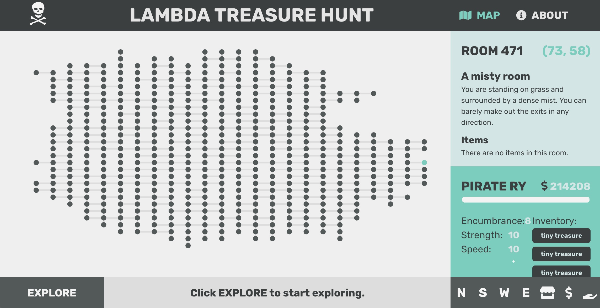

# CS Build Week 1

For your first CS Build Week, you will be building an interactive MUD client and server in groups. To succeed with this project, you will be applying knowledge you've learned throughout the first part of CS to this project.

You should treat this like a real-world job assignment with your instructor as the client. Like in the real world, you may not be given all the information you need to complete the assignment up front. It is your responsibility to understand the requirements and ask questions if anything is unclear (Polya) before jumping into the code.

## Roles

Each team must have a minimum of one Backend and one Frontend developer. The responsibilities will be as follows:

### Backend

1. [Learn Django](https://github.com/LambdaSchool/Intro-Django)
2. Deploy a [LambdaMUD server](https://github.com/LambdaSchool/LambdaMUD-Project)
3. Create an interesting world on the server


### Frontend

1. Deploy a [LambdaMUD client](https://github.com/LambdaSchool/LambdaMUD-Project) that connects to the test server at `https://lambda-mud-test.herokuapp.com/`
2. Connect your LambdaMUD client to the production server
3. Display a visual map of the world


## Details

### Backend

#### 1. Learn Django

In Week 1, you learned a new language (Python) and built an interactive world with it. This week, you will be learning a new web framework (Django) and building a more interesting world.

You may find these resources useful:

* [Intro to Django github repo](https://github.com/LambdaSchool/Intro-Django)
* [CS12: Intro to Django: Setup, Models, and Migrations](https://www.youtube.com/watch?v=5rfCWD0jB9U)
* [CS12: Intro to Django: GraphQL and Graphene](https://www.youtube.com/watch?v=0qsOwWTo2wc)
* [CS12: Intro to Django: REST and Users](https://www.youtube.com/watch?v=yMGUq3i1qBY)
* [CS12: Intro to Django: Token Auth, GraphQL Mutations](https://www.youtube.com/watch?v=_8nTE2NE5tg)

#### 2. Deploy a LambdaMUD server

Check out this repo for guidelines:

https://github.com/LambdaSchool/LambdaMUD-Project

You can consider Pusher websocket integration to be a stretch goal. Your server should interact with your team's client.

#### 3. Create an interesting world on the server

To create your world, you will need to [add rooms](https://github.com/LambdaSchool/LambdaMUD-Project/blob/master/util/create_world.py) to your server. You will need to create more rooms and descriptions to build a unique, traversable world that your client apps can interact with via REST API calls.

You will also need to implement a GET `rooms` API endpoint for clients to fetch all rooms to display a map on the frontend.

### Frontend

#### 1. Deploy a LambdaMUD client that connects to the test server

While your backend developers are implementing your production server, you may test your endpoints on the test server hosted at `https://lambda-mud-test.herokuapp.com/`. You can use this to test your interface for account registration, login, and movement throughout the world. (See [documentation](https://github.com/LambdaSchool/LambdaMUD-Project) for details.) Your app should store the user's auth token upon successful registration/authentication and use it to authenticate subsequent API requests.

#### 2. Connect your LambdaMUD client to the production server

Once your backend is up and running, you should be able to swap out the test host URL for your production URL and interact with your production server.

#### 3. Display a visual map of the world

Your backend should implement a `rooms` endpoint which will return data for every room in your world. Your job will be to build a map to display a map of those rooms, along with relevant information, like marking which room the player is currently in.


## FAQs and Troubleshooting

### 1. Can you show me an example of a map visualization?

Here's a sample project created by former CS SL [Ryan Walker](http://ryanwalker.dev):



### 2. How do I build something like that?

Think about the algorithm to draw your map. It will probably be something like this:

```
def draw_map():
    # Get all rooms
    # For each room in rooms...
        # Draw the room
        # Draw each exit
```

What data do you need to implement this? A list of rooms, their exits, maybe their positions? The server should return all the information you need from the `rooms` endpoint. Note that backend developers may need to define some fields in the `Room` model that do not exist yet.

### 3. How do I "create an interesting world"?

I'll leave that to you to determine.


### 4. What is Pusher?

Pusher is a cross-platform websocket library. This will allow you to turn your app into a real MUD with live push notifications to your client. You can consider integration to be a stretch goal but it's worth the effort if you have the time: websockets are powerful!


